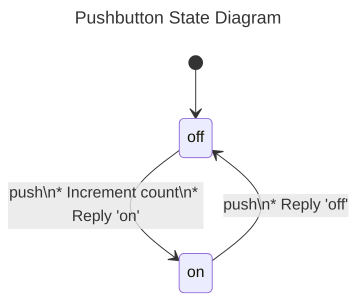

# `gen_statem`
[🔗](https://github.com/erlang/otp/blob/master/lib/stdlib/src/gen_statem.erl#L22)

Generic state machine behavior.

`gen_statem` provides a generic state machine behaviour
that since Erlang/OTP 20.0 replaces its predecessor `m:gen_fsm`,
and should be used for new code.  The `gen_fsm` behaviour
remains in OTP "as is" to not break old code using it.

A generic state machine server process (`gen_statem`) implemented
using this module has a standard set of interface functions
and includes functionality for tracing and error reporting.
It also fits into an OTP supervision tree.  For more information,
see [gen_statem section in OTP Design Principles](`e:system:statem.md`).

> #### Note {: .info }
>
> If you are new to `gen_statem` and want an overview
> of concepts and operation the section
> [`gen_statem` Behaviour](`e:system:statem.md`) located in
> the User's Guide [OTP Design Principles](`e:system:index.html`)
> is recommended to read.  This reference manual focuses on
> being correct and complete, which might make it hard to see
> the forest for all the trees.

#### Features

`gen_statem` has got the same features that `m:gen_fsm` had
and adds some really useful:

- [Co-located state code](#state_functions)
- [Arbitrary term state](#handle_event_function)
- [Event postponing](#event-postponing)
- [Self-generated events](#event-insertion)
- [State time-out](`t:state_timeout/0`)
- [Multiple generic named time-outs](`t:generic_timeout/0`)
- [Absolute time-out time](`t:timeout_option/0`)
- [Automatic state enter calls](#state-enter-calls)
- [Reply from other state than the request](#reply-to-a-call),
  traceable with `m:sys`
- [Multiple replies](#reply-to-a-call), traceable with `m:sys`
- [Changing the callback module](#change_callback_module)

Two [_callback modes_](`t:callback_mode/0`) are supported:

- `state_functions` - for finite-state machines (`m:gen_fsm` like),
  which requires the state to be an atom and uses that state
  as the name of the current callback function, arity 3.
- `handle_event_function` - that allows the state to be any term
  and that uses `c:handle_event/4` as callback function for all states.

The callback modes for `gen_statem` differs from the one for
`gen_fsm`, but it is still fairly easy to
rewrite from `gen_fsm` to `gen_statem`.  See the
[rewrite guide](`m:gen_fsm#module-migration-to-gen_statem`)
at the start of the `m:gen_fsm` documentation.

#### Callback module

A `gen_statem` assumes all specific parts to be located
in a callback module exporting a predefined set of functions.
The relationship between the behavior functions
and the callback functions is as follows:

```
gen_statem module            Callback module
-----------------            ---------------
gen_statem:start
gen_statem:start_monitor
gen_statem:start_link -----> Module:init/1

Server start or code change
                      -----> Module:callback_mode/0
                      selects callback mode

gen_statem:stop
Supervisor exit
Callback failure      -----> Module:terminate/3

gen_statem:call
gen_statem:cast
gen_statem:send_request
erlang:send
erlang:'!'            -----> Module:StateName/3
                   or -----> Module:handle_event/4
                   depending on callback mode

Release upgrade/downgrade
(code change)
                      -----> Module:code_change/4
```

#### State callback {: #state-callback }

The _state callback_ for a specific [state](`t:state/0`) in a `gen_statem`
is the callback function that is called for all events in this state.
It is selected depending on which [_callback mode_](`t:callback_mode/0`)
that the callback module defines with the callback function
[`Module:callback_mode/0`](`c:callback_mode/0`).

[](){: #state_functions }
When the [_callback mode_](`t:callback_mode/0`) is `state_functions`,
the state must be an atom and is used as the _state callback_ name;
see [`Module:StateName/3`](`c:'StateName'/3`).  This co-locates all code
for a specific state in one function as the `gen_statem` engine branches
depending on state name.  Note the fact that the callback function
[`Module:terminate/3`](`c:terminate/3`) makes the state name `terminate`
unusable in this mode.

[](){: #handle_event_function }
When the [_callback mode_](`t:callback_mode/0`) is `handle_event_function`,
the state can be any term and the _state callback_ name is
[`Module:handle_event/4`](`c:handle_event/4`). This makes it easy
to branch depending on state or event as you desire. Be careful about
which events you handle in which states so that you do not accidentally
postpone an event forever creating an infinite busy loop.

#### Event types

Events are of different [types](`t:event_type/0`),
therefore the callback functions can know the origin of an event
when handling it.  [External events](`t:external_event_type/0`) are
`call`,  `cast`, and  `info`. Internal events are
[`timeout`](`t:timeout_event_type/0`) and `internal`.

#### Event handling

When `gen_statem` receives a process message it is transformed
into an event and the [_state callback_](#state-callback)
is called with the event as two arguments: type and content. When the
[_state callback_](#state-callback) has processed the event
it returns to `gen_statem` which does a _state transition_. If this
_state transition_ is to a different state, that is: `NextState =/= State`,
it is a _state change_.

#### Transition actions

The [_state callback_](#state-callback) may return
[_transition actions_](`t:action/0`) for `gen_statem` to execute
during the _state transition_, for example to set a time-out
or reply to a call.

#### Reply to a call {: #reply-to-a-call }

See [`gen_statem:call/2,3`](#call-reply) about how to reply
to a call.  A reply can be sent from any _state callback_,
not just the one that got the request event.

#### Event postponing {: #event-postponing }

One of the possible _transition actions_ is to postpone the current event.
Then it will not be handled in the current state.  The `gen_statem` engine
keeps a queue of events divided into postponed events and
events still to process (not presented yet).  After a _state change_
the queue restarts with the postponed events.

The `gen_statem` event queue model is sufficient to emulate
the normal process message queue with selective receive.
Postponing an event corresponds to not matching it
in a receive statement, and changing states corresponds to
entering a new receive statement.

#### Event insertion {: #event-insertion }

The [_state callback_](#state-callback) can insert
events using the [_transition action_](`t:action/0`) `next_event`,
and such an event is inserted in the event queue as the next to call the
[_state callback_](#state-callback) with. That is,
as if it is the oldest incoming event. A dedicated `t:event_type/0`
`internal` can be used for such events making it possible to
safely distinguish them from external events.

Inserting an event replaces the trick of calling your own state handling
functions that you often would have to resort to in, for example,
`m:gen_fsm` to force processing an inserted event before others.

> #### Note {: .info }
>
> If you postpone an event and (against good practice) directly call
> a different _state callback_, the postponed event is not retried,
> since there was no _state change_.
>
> Instead of directly calling a _state callback_, do a _state change_.
> This makes the `gen_statem` engine retry postponed events.
>
> Inserting an event in a _state change_ also triggers
> the new  _state callback_ to be called with that event
> before receiving any external events.

#### State enter calls {: #state-enter-calls }

The `gen_statem` engine can automatically make a special call to the
[_state callback_](#state-callback) whenever a new state is
entered; see `t:state_enter/0`. This is for writing code common
to all state entries.  Another way to do it is to explicitly insert
an event at the _state transition_, and/or to use a dedicated
_state transition_ function, but that is something you will have to
remember at every _state transition_ to the state(s) that need it.

For the details of a _state transition_, see type `t:transition_option/0`.

#### Hibernation

The `gen_statem` process can go into hibernation;
see `proc_lib:hibernate/3`. It is done when
a [_state callback_](#state-callback) or
[`Module:init/1`](`c:init/1`) specifies `hibernate`
in the returned [`Actions`](`t:enter_action/0`) list. This feature
can be useful to reclaim process heap memory while the server
is expected to be idle for a long time. However, use it with care,
as hibernation can be too costly to use after every event;
see `erlang:hibernate/3`.

There is also a server start option
[`{hibernate_after, Timeout}`](`t:enter_loop_opt/0`)
for [`start/3,4`](`start/3`), [`start_link/3,4`](`start_link/3`),
[`start_monitor/3,4`](`start_monitor/3`),
or [`enter_loop/4,5,6`](`enter_loop/6`), that may be used
to automatically hibernate the server.

#### Callback failure

If a callback function fails or returns a bad value,
the `gen_statem` terminates.  However, an exception of class
[`throw`](`erlang:throw/1`) is not regarded as an error
but as a valid return, from all callback functions.

#### System messages and the `m:sys` module

A `gen_statem` handles system messages as described in `m:sys`.
The `m:sys` module can be used for debugging a `gen_statem`.
Replies sent through [_transition actions_](`t:action/0`)
gets logged, but not replies sent through [`reply/1,2`](`reply/2`).

#### Trapping exit

A `gen_statem` process, like all `gen_`\* behaviours,
does not trap exit signals automatically;
this must be explicitly initiated in the callback module
(by calling [`process_flag(trap_exit, true)`](`erlang:process_flag/2`)
preferably from `c:init/1`.

#### Server termination

If the `gen_statem` process terminates, e.g. as a result
of a callback function returning `{stop, Reason}`, an exit signal
with this `Reason` is sent to linked processes and ports.
See [Processes](`e:system:ref_man_processes.md#errors`)
in the Reference Manual for details regarding error handling
using exit signals.

> #### Note {: .info }
>
> For some important information about distributed signals, see the
> [_Blocking Signaling Over Distribution_
> ](`e:system:ref_man_processes.md#blocking-signaling-over-distribution`)
> section in the _Processes_ chapter of the _Erlang Reference Manual_.
> Blocking signaling can, for example, cause call time-outs in `gen_statem`
> to be significantly delayed.

#### Bad argument

Unless otherwise stated, all functions in this module fail if the specified
`gen_statem` does not exist or if bad arguments are specified.

## Example

The following example shows a simple pushbutton model
for a toggling pushbutton implemented with
[_callback mode_](`t:callback_mode/0`) `state_functions`.
You can push the button and it replies if it went on or off,
and you can ask for a count of how many times it has been pushed
to switch on.

### Pushbutton State Diagram



Not shown in the state diagram:
* The API function `push()` generates an event `push` of type `call`.
* The API function `get_count()` generates an event `get_count`
  of type `call` that is handled in all states by replying with
  the current count value.
* Unknown events are ignored and discarded.
* There is boilerplate code for start, stop, terminate, code change,
  init, to set the callback mode to `state_functions`, etc...

### Pushbutton Code

The following is the complete callback module file `pushbutton.erl`:

```erlang
-module(pushbutton).
-behaviour(gen_statem).

-export([start/0,push/0,get_count/0,stop/0]).
-export([terminate/3,code_change/4,init/1,callback_mode/0]).
-export([on/3,off/3]).

name() -> pushbutton_statem. % The registered server name

%% API.  This example uses a registered name name()
%% and does not link to the caller.
start() ->
    gen_statem:start({local,name()}, ?MODULE, [], []).
push() ->
    gen_statem:call(name(), push).
get_count() ->
    gen_statem:call(name(), get_count).
stop() ->
    gen_statem:stop(name()).

%% Mandatory callback functions
terminate(_Reason, _State, _Data) ->
    void.
code_change(_Vsn, State, Data, _Extra) ->
    {ok,State,Data}.
init([]) ->
    %% Set the initial state + data.  Data is used only as a counter.
    State = off, Data = 0,
    {ok,State,Data}.
callback_mode() -> state_functions.

%%% state callback(s)

off({call,From}, push, Data) ->
    %% Go to 'on', increment count and reply
    %% that the resulting status is 'on'
    {next_state,on,Data+1,[{reply,From,on}]};
off(EventType, EventContent, Data) ->
    handle_event(EventType, EventContent, Data).

on({call,From}, push, Data) ->
    %% Go to 'off' and reply that the resulting status is 'off'
    {next_state,off,Data,[{reply,From,off}]};
on(EventType, EventContent, Data) ->
    handle_event(EventType, EventContent, Data).

%% Handle events common to all states
handle_event({call,From}, get_count, Data) ->
    %% Reply with the current count
    {keep_state,Data,[{reply,From,Data}]};
handle_event(_, _, Data) ->
    %% Ignore all other events
    {keep_state,Data}.
```

The following is a shell session when running it:

```erlang
1> pushbutton:start().
{ok,<0.36.0>}
2> pushbutton:get_count().
0
3> pushbutton:push().
on
4> pushbutton:get_count().
1
5> pushbutton:push().
off
6> pushbutton:get_count().
1
7> pushbutton:stop().
ok
8> pushbutton:push().
** exception exit: {noproc,{gen_statem,call,[pushbutton_statem,push,infinity]}}
     in function  gen:do_for_proc/2 (gen.erl, line 261)
     in call from gen_statem:call/3 (gen_statem.erl, line 386)
```

To compare styles, here follows the same example using
[_callback mode_](`t:callback_mode/0`) `handle_event_function`,
or rather, the code to replace after function [`init/1`](`c:init/1`)
of the `pushbutton.erl` example file above:

```erlang
callback_mode() -> handle_event_function.

%%% state callback(s)

handle_event({call,From}, push, off, Data) ->
    %% Go to 'on', increment count and reply
    %% that the resulting status is 'on'
    {next_state,on,Data+1,[{reply,From,on}]};
handle_event({call,From}, push, on, Data) ->
    %% Go to 'off' and reply that the resulting status is 'off'
    {next_state,off,Data,[{reply,From,off}]};
%%
%% Event handling common to all states
handle_event({call,From}, get_count, State, Data) ->
    %% Reply with the current count
    {next_state,State,Data,[{reply,From,Data}]};
handle_event(_, _, State, Data) ->
    %% Ignore all other events
    {next_state,State,Data}.
```

> #### Note {: .info }
> ## API changes
> - This behavior appeared in Erlang/OTP 19.0 as experimental.
> - In OTP 19.1 a backwards incompatible change of the return tuple from
>   [`Module:init/1`](`c:init/1`) was made,
>   the mandatory callback function
>   [`Module:callback_mode/0`](`c:callback_mode/0`) was introduced,
>   and `enter_loop/4` was added.
> - In OTP 19.2 [_state enter calls_](`t:state_enter/0`) were added.
> - In OTP 19.3 [state time-outs](`t:state_timeout/0`) were added.
> - In OTP 20.0 [generic time-outs](`t:generic_timeout/0`) were added
>   and `gen_statem` was stated to be no longer experimental and
>   preferred over `gen_fsm`.
> - In OTP 22.1 time-out content [`update`](`t:timeout_update_action/0`)
>   and explicit time-out [`cancel`](`t:timeout_cancel_action/0`)
>   were added.
> - In OTP 22.3 the possibility to change the callback module with actions
>   [`change_callback_module`](#change_callback_module),
>   [`push_callback_module`](#push_callback_module) and
>   [`pop_callback_module`](#pop_callback_module), was added.
> - In OTP 23.0 [`start_monitor/3,4`](`start_monitor/3`) were added,
>   as well as functions for asynchronous calls: `send_request/2`,
>   [`wait_response/1,2`](`wait_response/2`), and `check_response/2`.
> - In OTP 24.0 [`receive_response/1,2`](`receive_response/2`) were added.
> - In OTP 25.0 [`Module:format_status/1`](`c:format_status/1`)
>   was added to replace [`Module:format_status/2`](`c:format_status/2`),
>   as well as functions for collections of asynchronous calls:
>   `send_request/4`, `wait_response/3`, `receive_response/3`,
>   `check_response/3`, `reqids_new/0`, `reqids_size/1`,
>   `reqids_add/3`, `reqids_to_list/1`.
> - In OTP 26.0 the possibility to return `{error, Reason}` from
>   [`Module:init/1`](`c:init/1`) was added.
> - In OTP 27.0 [`Module:format_status/2`](`c:format_status/2`)
>   was deprecated.

### See Also

`m:gen_event`, `m:gen_fsm`, `m:gen_server`, `m:proc_lib`, `m:supervisor`,
`m:sys`.

# `action`
*since OTP 19.0* 

```erlang
-type action() ::
          postpone |
          {postpone, Postpone :: postpone()} |
          {next_event, EventType :: event_type(), EventContent :: event_content()} |
          {change_callback_module, NewModule :: module()} |
          {push_callback_module, NewModule :: module()} |
          pop_callback_module |
          enter_action().
```

Actions for a _state transition_, or when starting the server.

These _transition actions_ can be invoked by returning them from the
[_state callback_](#state-callback) when it is called
with an [event](`t:event_type/0`), from [`Module:init/1`](`c:init/1`)
or by passing them to [`enter_loop/4,5,6`](`enter_loop/6`).
They are **not allowed** from _state enter calls_.

Actions are executed in the containing list order.

Actions that set [transition options](`t:transition_option/0`)
override any previous of the same type, so the last
in the containing list wins.  For example, the last `t:postpone/0`
overrides any previous `t:postpone/0` in the list.

- **`{postpone, Value}`** - Sets the
  [`transition_option()` ](`t:transition_option/0`)`t:postpone/0`
  for this _state transition_.  This action is ignored when returned from
  [`Module:init/1`](`c:init/1`) or passed to
  [`enter_loop/4,5,6`](`enter_loop/6`), as there is no event to postpone
  in those cases.

  `postpone` is equivalent to `{postpone, true}`.

- **`{next_event, EventType, EventContent}`** - This action
  does not set any [`transition_option()`](`t:transition_option/0`)
  but instead stores the specified `EventType` and `EventContent`
  for insertion after all actions have been executed.

  The stored events are inserted in the queue as the next to process
  before any already queued events. The order of these stored events
  is preserved, so the first `next_event` in the containing list
  becomes the first to process.

  An event of type [`internal`](`t:event_type/0`) should be used
  when you want to reliably distinguish an event inserted this way
  from any external event.

- **`{change_callback_module, NewModule}`** {: #change_callback_module } -
  Changes the callback module to `NewModule` which will be used
  when calling all subsequent [state callbacks](#state-callback).\
  **Since OTP 22.3.**

  The `gen_statem` engine will find out the
  [_callback mode_](`t:callback_mode/0`) of `NewModule` by calling
  [`NewModule:callback_mode/0`](`c:callback_mode/0`) before the next
  [state callback](#state-callback).

  Changing the callback module does not affect the _state transition_
  in any way, it only changes which module that handles the events.
  Be aware that all relevant callback functions in `NewModule` such as
  the [state callback](#state-callback),
  [`NewModule:code_change/4`](`c:code_change/4`),
  [`NewModule:format_status/1`](`c:format_status/1`) and
  [`NewModule:terminate/3`](`c:terminate/3`) must be able to handle
  the state and data from the old module.

- **`{push_callback_module, NewModule}`** {: #push_callback_module } -
   Pushes the current callback module to the top of an internal stack
   of callback modules, and changes the callback module to `NewModule`.
   Otherwise like `{change_callback_module, NewModule}` above.\
  **Since OTP 22.3.**

- **`pop_callback_module`** {: #pop_callback_module } -
  Pops the top module from the internal stack of callback modules
  and changes the callback module to be the popped module.
  If the stack is empty the server fails.
  Otherwise like `{change_callback_module, NewModule}` above.\
  **Since OTP 22.3.**

# `callback_mode`
*not exported* *since OTP 19.1* 

```erlang
-type callback_mode() :: state_functions | handle_event_function.
```

One function per state or one common event handler.

The _callback mode_ is selected with the return value from
[`Module:callback_mode/0`](`c:callback_mode/0`):

- **`state_functions`** - The state must be of type `t:state_name/0`
  and one callback function per state, that is,
  [`Module:StateName/3`](`c:'StateName'/3`), is used.

- **`handle_event_function`** - The state can be any term and the callback
  function [`Module:handle_event/4`](`c:handle_event/4`)
  is used for all states.

The function [`Module:callback_mode/0`](`c:callback_mode/0`) is called
when starting the `gen_statem`, after code change and after changing
the callback module with any of the actions
[`change_callback_module`](#change_callback_module),
[`push_callback_module`](#push_callback_module),
or [`pop_callback_module`](#pop_callback_module).
The result is cached for subsequent calls to
[_state callbacks_](#state-callback).

# `callback_mode_result`
*since OTP 19.2* 

```erlang
-type callback_mode_result() :: callback_mode() | [callback_mode() | state_enter()].
```

Return value from [`Module:callback_mode/0`](`c:callback_mode/0`).

This is the return type from
[`Module:callback_mode/0`](`c:callback_mode/0`)
which selects [_callback mode_](`t:callback_mode/0`)
and whether to do [_state enter calls_](`t:state_enter/0`),
or not.

# `data`
*not exported* *since OTP 19.0* 

```erlang
-type data() :: term().
```

Generic state data for the server.

A term in which the state machine implementation is to store
any server data it needs. The difference between this and the `t:state/0`
itself is that a change in this data does not cause postponed events
to be retried. Hence, if a change in this data would change
the set of events that are handled, then that data item
should be part of the `t:state/0` instead.

# `enter_action`
*since OTP 19.0* 

```erlang
-type enter_action() ::
          hibernate | {hibernate, Hibernate :: hibernate()} | timeout_action() | reply_action().
```

Actions for any callback: hibernate, time-outs or replies.

These _transition actions_ are allowed when a `t:action/0` is allowed,
and also from a _state enter call_, and can be invoked
by returning them from the [_state callback_](#state-callback), from
[`Module:init/1`](`c:init/1`) or by passing them to
[`enter_loop/4,5,6`](`enter_loop/6`).

Actions are executed in the containing list order.

Actions that set [transition options](`t:transition_option/0`)
override any previous of the same type,
so the last in the containing list wins. For example,
the last `t:event_timeout/0` overrides any previous
`t:event_timeout/0` in the list.

- **`{hibernate, Value}`** - Sets the `t:transition_option/0`
  `t:hibernate/0` for this _state transition_.

  `hibernate` is equivalent to `{hibernate, true}`.

# `enter_loop_opt`
*since OTP 19.0* 

```erlang
-type enter_loop_opt() ::
          {hibernate_after, HibernateAfterTimeout :: timeout()} | {debug, Dbgs :: [sys:debug_option()]}.
```

Server [start options](#start-options) for the
[`enter_loop/4,5,6`](`enter_loop/6`),
[`start/3,4`](`start/3`), [`start_link/3,4`](`start_link/3`),
and [`start_monitor/3,4`](`start_monitor/3`), functions.

See [`start_link/4`](#start-options).

# `event_content`
*not exported* *since OTP 19.0* 

```erlang
-type event_content() :: term().
```

Event payload from the event's origin, delivered to
the [_state callback_](#state-callback).

See [`event_type`](`t:event_type/0`) that describes the origins of
the different event types, which is also where the event's content
comes from.

# `event_handler_result`
*since OTP 19.0* 

```erlang
-type event_handler_result(StateType) :: event_handler_result(StateType, term()).
```

# `event_handler_result`
*since OTP 19.0* 

```erlang
-type event_handler_result(StateType, DataType) ::
          {next_state, NextState :: StateType, NewData :: DataType} |
          {next_state, NextState :: StateType, NewData :: DataType, Actions :: [action()] | action()} |
          state_callback_result(action(), DataType).
```

Return value from a [_state callback_](#state-callback)
after handling an event.

`StateType` is `t:state_name/0`
if [_callback mode_](`t:callback_mode/0`) is `state_functions`,
or `t:state/0`
if [_callback mode_](`t:callback_mode/0`) is `handle_event_function`.

- **`{next_state, NextState, NewData [, Actions]}`** -
  The `gen_statem` does a _state transition_ to `NextState`
  (which may be the same as the current state), sets `NewData`
  as the current server `t:data/0`, and executes all `Actions`.
  If `NextState =/= CurrentState` the _state transition_
  is a _state change_.

# `event_timeout`
*not exported* *since OTP 19.0* 

```erlang
-type event_timeout() :: Time :: timeout() | integer().
```

How long to wait for an event.

Starts a timer set by `t:timeout_action/0`
`Time`, or `{timeout, Time, EventContent [, Options]}`.

When the timer expires an event of `t:event_type/0` `timeout`
will be generated. See `erlang:start_timer/4` for how `Time`
and [`Options`](`t:timeout_option/0`) are interpreted.  Future
`erlang:start_timer/4` `Options` will not necessarily be supported.

Any event that arrives cancels this time-out. Note that a retried
or inserted event counts as arrived. So does a state time-out zero event,
if it was generated before this time-out is requested.

If `Time` is `infinity`, no timer is started,
as it never would expire anyway.

If `Time` is relative and `0` no timer is actually started,
instead the the time-out event is enqueued to ensure
that it gets processed before any not yet received external event,
but after already queued events.

Note that it is not possible nor needed to cancel this time-out,
as it is cancelled automatically by any other event, meaning that
whenever a callback is invoked that may want to cancel this time-out,
the timer is already cancelled or expired.

The timer `EventContent` can be updated with the
[`{timeout, update, NewEventContent}`](`t:timeout_update_action/0`)
action without affecting the time of expiry.

# `event_type`
*since OTP 19.0* 

```erlang
-type event_type() :: external_event_type() | timeout_event_type() | internal.
```

All event types: [external](`t:external_event_type/0`),
[time-out](`t:timeout_event_type/0`), or `internal`.

`internal` events can only be generated by the state machine itself
through the _transition action_ [`next_event`](`t:action/0`).

# `external_event_type`
*not exported* *since OTP 19.0* 

```erlang
-type external_event_type() :: {call, From :: from()} | cast | info.
```

Event from a [call](`call/3`), [cast](`cast/2`),
or regular process message; "info".

Type `{call, From}` originates from the API functions
[`call/2,3`](`call/3`) or `send_request/2`.  The event contains
[`From`](`t:from/0`), which is whom to reply to
by a `t:reply_action/0` or [`reply/2,3`](`reply/2`) call.

Type `cast` originates from the API function `cast/2`.

Type `info` originates from regular process messages
sent to the `gen_statem` process.

# `format_status`
*since OTP 19.0* 

```erlang
-type format_status() ::
          #{state => state(),
            data => data(),
            reason => term(),
            queue => [{event_type(), event_content()}],
            postponed => [{event_type(), event_content()}],
            timeouts => [{timeout_event_type(), event_content()}],
            log => [sys:system_event()]}.
```

A map that describes the server's status.

The keys are:
- **`state`** - The current state.
- **`data`** - The state data.
- **`reason`** - The reason that caused the process to terminate.
- **`queue`** - The event queue.
- **`postponed`** - The queue of [postponed](`t:postpone/0`) events.
- **`timeouts`** - The active [time-outs](`t:timeout_action/0`).
- **`log`** - The [sys log](`sys:log/2`) of the server.

New associations may be added to the status map without prior notice.

# `from`
*since OTP 19.0* 

```erlang
-type from() :: {To :: pid(), Tag :: reply_tag()}.
```

A [`call`](`t:external_event_type/0`) event's reply destination.

Destination to use when replying through, for example,
the action [`{reply, From, Reply}`](`t:reply_action/0`)
to a process that has called the `gen_statem` server
using [`call/2,3`](`call/3`).

# `generic_timeout`
*not exported* *since OTP 20.0* 

```erlang
-type generic_timeout() :: Time :: timeout() | integer().
```

How long to wait for a named time-out event.

Starts a timer set by `t:timeout_action/0`
`{{timeout, Name}, Time, EventContent [, Options]}`.

When the timer expires an event of `t:event_type/0` `{timeout, Name}`
will be generated. See `erlang:start_timer/4` for how `Time`
and [`Options`](`t:timeout_option/0`) are interpreted. Future
`erlang:start_timer/4` `Options` will not necessarily be supported.

If `Time` is `infinity`, no timer is started,
as it never would expire anyway.

If `Time` is relative and `0` no timer is actually started,
instead the time-out event is enqueued to ensure
that it gets processed before any not yet received external event.

Setting a timer with the same `Name` while it is running
will restart it with the new time-out value.  Therefore it is possible
to cancel a specific time-out by setting it to `infinity`.
It can also be cancelled more explicitly with the
[`{{timeout, Name}, cancel}`](`t:timeout_cancel_action/0`) action.

The timer `EventContent` can be updated with the
[`{{timeout, Name}, update, NewEventContent}`](`t:timeout_update_action/0`)
action without affecting the time of expiry.

# `hibernate`
*not exported* *since OTP 19.0* 

```erlang
-type hibernate() :: boolean().
```

Hibernate the server process.

If `true`, hibernates the `gen_statem` by calling `proc_lib:hibernate/3`
before going into `receive` to wait for a new external event.

There is also a server start option
[`{hibernate_after, Timeout}`](`t:enter_loop_opt/0`)
for automatic hibernation.

> #### Note {: .info }
>
> If there are enqueued events to process when hibernation is requested,
> this is optimized by not hibernating but instead calling
> [`erlang:garbage_collect/0`](`erlang:garbage_collect/0`) to simulate,
> in a more efficient way, that the `gen_statem` entered hibernation
> and immediately got awakened by an enqueued event.

# `init_result`
*since OTP 19.0* 

```erlang
-type init_result(StateType) :: init_result(StateType, term()).
```

# `init_result`
*since OTP 19.0* 

```erlang
-type init_result(StateType, DataType) ::
          {ok, State :: StateType, Data :: DataType} |
          {ok, State :: StateType, Data :: DataType, Actions :: [action()] | action()} |
          ignore |
          {stop, Reason :: term()} |
          {error, Reason :: term()}.
```

The return value from [`Module:init/1`](`c:init/1`).

For a succesful initialization, `State` is the initial `t:state/0`,
and `Data` the initial server `t:data/0` of the `gen_statem`.

The [`Actions`](`t:action/0`) are executed when entering the first
[state](`t:state/0`) just as for a
[_state callback_](#state-callback), except that the action
`postpone` is forced to `false` since there is no event to postpone.

For an unsuccesful initialization, `{stop, Reason}`, `{error, Reason}`,
or `ignore` should be used; see [`start_link/3,4`](`start_link/3`).

`{error, Reason}` has been allowed **since OTP 26.0**.

The `{ok, ...}` tuples have existed **since OTP 19.1**,
before that they were not `ok` tagged.  This was before
`gen_statem` replaced `gen_fsm` in OTP 20.0.

# `postpone`
*not exported* *since OTP 19.0* 

```erlang
-type postpone() :: boolean().
```

Postpone an event to handle it later.

If `true`, postpones the current event.
After a _state change_ (`NextState =/= State`), it is retried.

# `reply_action`
*since OTP 19.0* 

```erlang
-type reply_action() :: {reply, From :: from(), Reply :: term()}.
```

Reply to a [`call/2,3`](`call/3`).

This _transition action_ can be invoked by returning it from the
[_state callback_](#state-callback), from
[`Module:init/1`](`c:init/1`) or by passing it to
[`enter_loop/4,5,6`](`enter_loop/6`).

It does not set any [`transition_option()`](`t:transition_option/0`)
but instead replies to a caller waiting for a reply in `call/3`.
`From` must be the term from argument [`{call, From}`](`t:event_type/0`)
in a call to a [_state callback_](#state-callback).

Note that using this action from [`Module:init/1`](`c:init/1`) or
[`enter_loop/4,5,6`](`enter_loop/6`) would be weird
on the border of witchcraft since there has been no earlier call to a
[_state callback_](#state-callback) in this server.

# `reply_tag`
*since OTP 19.0* 

```erlang
-opaque reply_tag()
```

A handle that associates a reply to the corresponding request.

# `request_id`
*since OTP 19.0* 

```erlang
-opaque request_id()
```

An opaque request identifier. See `send_request/2` for details.

# `request_id_collection`
*since OTP 19.0* 

```erlang
-opaque request_id_collection()
```

An opaque collection of request identifiers (`t:request_id/0`).

Each request identifier can be associated with
a label chosen by the user.  For more information see `reqids_new/0`.

# `response_timeout`
*not exported* *since OTP 19.0* 

```erlang
-type response_timeout() :: timeout() | {abs, integer()}.
```

Response time-out for an asynchronous call.

Used to set a time limit on how long to wait for a response using either
`receive_response/2`, `receive_response/3`, `wait_response/2`, or
`wait_response/3`.  The time unit used is `millisecond`.

 Currently valid values:

- **`0..4294967295`** - Time-out relative to current time in milliseconds.

- **`infinity`** - Infinite time-out. That is,
  the operation will never time out.

- **`{abs, Timeout}`** - An absolute
  [Erlang monotonic time](`erlang:monotonic_time/1`)
  time-out in milliseconds.  That is, the operation will time out when
  [`erlang:monotonic_time(millisecond)`](`erlang:monotonic_time/1`)
  returns a value larger than or equal to `Timeout`.
  `Timeout` is not allowed to identify a time further into the future
  than `4294967295` milliseconds.  Specifying the time-out
  using an absolute value is especially handy when you have
  a deadline for responses corresponding to a complete collection
  of requests (`t:request_id_collection/0`), since you do not have to
  recalculate the relative time until the deadline over and over again.

# `server_name`
*since OTP 19.0* 

```erlang
-type server_name() ::
          {local, atom()} | {global, GlobalName :: term()} | {via, RegMod :: module(), Name :: term()}.
```

Server name specification: `local`, `global`, or `via` registered.

Name specification to use when starting a `gen_statem` server.
See `start_link/3` and `t:server_ref/0` below.

# `server_ref`
*since OTP 19.0* 

```erlang
-type server_ref() ::
          pid() |
          (LocalName :: atom()) |
          {Name :: atom(), Node :: atom()} |
          {global, GlobalName :: term()} |
          {via, RegMod :: module(), ViaName :: term()}.
```

Server specification: `t:pid/0` or registered `t:server_name/0`.

To be used in [`call/2,3`](`call/3`) to specify the server.

It can be:

- **`pid() | LocalName`** - The `gen_statem` is locally registered.

- **`{Name, Node}`** - The `gen_statem` is locally registered
  on another node.

- **`{global, GlobalName}`** - The `gen_statem` is globally registered
  in `m:global`.

- **`{via, RegMod, ViaName}`** - The `gen_statem` is registered
  in an alternative process registry.  The registry callback module
  `RegMod` is to export functions `register_name/2`, `unregister_name/1`,
  `whereis_name/1`, and `send/2`, which are to behave like
  the corresponding functions in `m:global`.
  Thus, `{via, global, GlobalName}` is the same as `{global, GlobalName}`.

# `start_mon_ret`
*since OTP 19.0* 

```erlang
-type start_mon_ret() :: {ok, {pid(), reference()}} | ignore | {error, term()}.
```

Return value from the [`start_monitor/3,4`](`start_monitor/3`) functions.

As for [`start_link/4`](#start-return-values) but a succesful return
wraps the process ID and the [monitor reference](`erlang:monitor/2`) in a
`{ok, {`[`pid()`](`t:pid/0`)`, `[`reference()`](`t:reference/0`)`}}`
tuple.

# `start_opt`
*since OTP 19.0* 

```erlang
-type start_opt() ::
          {timeout, Time :: timeout()} | {spawn_opt, [proc_lib:start_spawn_option()]} | enter_loop_opt().
```

Server [start options](#start-options) for the
[`start/3,4`](`start/3`), [`start_link/3,4`](`start_link/3`),
and [`start_monitor/3,4`](`start_monitor/3`) functions.

See [`start_link/4`](#start-options).

# `start_ret`
*since OTP 19.0* 

```erlang
-type start_ret() :: {ok, pid()} | ignore | {error, term()}.
```

[Return value](#start-return-values) from the [`start/3,4`](`start/3`)
and [`start_link/3,4`](`start_link/3`) functions.

See [`start_link/4`](#start-return-values).

# `state`
*not exported* *since OTP 19.0* 

```erlang
-type state() :: state_name() | term().
```

State name or state term.

If the [_callback mode_](`t:callback_mode/0`) is `handle_event_function`,
the state can be any term. After a _state change_ (`NextState =/= State`),
all postponed events are retried.

Comparing two states for strict equality is assumed to be a fast operation,
since for every _state transition_ the `gen_statem` engine has to deduce
if it is a  _state change_.

> #### Note {: .info }
> The smaller the state term, in general, the faster the comparison.
>
> Note that if the "same" state term is returned for a state transition
> (or a return action without a `NextState` field is used),
> the comparison for equality is always fast because that can be seen
> from the term handle.
>
> But if a newly constructed state term is returned,
> both the old and the new state terms will have to be traversed
> until an inequality is found, or until both terms
> have been fully traversed.
>
> So it is possible to use large state terms that are fast to compare,
> but very easy to accidentally mess up.  Using small state terms is
> the safe choice.

# `state_callback_result`
*not exported* *since OTP 19.0* 

```erlang
-type state_callback_result(ActionType, DataType) ::
          {keep_state, NewData :: DataType} |
          {keep_state, NewData :: DataType, Actions :: [ActionType] | ActionType} |
          keep_state_and_data |
          {keep_state_and_data, Actions :: [ActionType] | ActionType} |
          {repeat_state, NewData :: DataType} |
          {repeat_state, NewData :: DataType, Actions :: [ActionType] | ActionType} |
          repeat_state_and_data |
          {repeat_state_and_data, Actions :: [ActionType] | ActionType} |
          stop |
          {stop, Reason :: term()} |
          {stop, Reason :: term(), NewData :: DataType} |
          {stop_and_reply, Reason :: term(), Replies :: [reply_action()] | reply_action()} |
          {stop_and_reply,
           Reason :: term(),
           Replies :: [reply_action()] | reply_action(),
           NewData :: DataType}.
```

Return value from any [_state callback_](#state-callback).

`ActionType` is `t:enter_action/0` if the state callback
was called with a [_state enter call_](`t:state_enter/0`),
and `t:action/0` if the state callback was called with an event.

- **`{keep_state, NewData [, Actions]}`** - The same as
  `{next_state, CurrentState, NewData [, Actions]}`.

- **`keep_state_and_data | {keep_state_and_data, Actions}`** -
  The same as `{keep_state, CurrentData [, Actions]}`.

- **`{repeat_state, NewData [, Actions]}`** - If the `gen_statem`
  runs with [_state enter calls_](`t:state_enter/0`),
  the _state enter call_ is repeated, see type `t:transition_option/0`.
  Other than that `{repeat_state, NewData [, Actions]}` is the same as
  `{keep_state, NewData [, Actions]}`.

- **`repeat_state_and_data | {repeat_state_and_data, Actions}`** -
  The same as `{repeat_state, CurrentData [, Actions]}`.

- **`{stop, Reason [, NewData]}`** - Terminates the `gen_statem`
  by calling [`Module:terminate/3`](`c:terminate/3`)
  with `Reason` and `NewData`, if specified. An exit signal
  with this reason is sent to linked processes and ports.

- **`stop`** - The same as `{stop, normal}`.

- **`{stop_and_reply, Reason, Replies [, NewData]}`** -
  Sends all `Replies`, then terminates the `gen_statem`
  like with `{stop, Reason [, NewData]}`.

All these terms are tuples or atoms and will be so
in all future versions of `gen_statem`.

# `state_enter`
*not exported* *since OTP 19.2* 

```erlang
-type state_enter() :: state_enter.
```

[_Callback mode_](`t:callback_mode/0`) modifier
for _state enter calls_: the atom `state_enter`.

Both _callback modes_ can use _state enter calls_,
and this is selected by adding this `state_enter` flag
to the [_callback mode_](`t:callback_mode/0`) return value from
[`Module:callback_mode/0`](`c:callback_mode/0`).

If [`Module:callback_mode/0`](`c:callback_mode/0`) returns
a list containing `state_enter`, the `gen_statem` engine will,
at every _state change_, that is; `NextState =/= CurrentState`,
call the [_state callback_](#state-callback) with arguments
`(enter, OldState, Data)` or `(enter, OldState, State, Data)`,
depending on the [_callback mode_](`t:callback_mode/0`).

This may look like an event but is really a call performed
after the previous [_state callback_](#state-callback) returned,
and before any event is delivered to the new
[_state callback_](#state-callback).
See [`Module:StateName/3`](`c:'StateName'/3`) and
[`Module:handle_event/4`](`c:handle_event/4`).  A _state enter call_
may be repeated without doing a _state change_ by returning
a [`repeat_state`](`t:state_callback_result/2`) or
[`repeat_state_and_data`](`t:state_callback_result/2`) action
from the _state callback_.

If [`Module:callback_mode/0`](`c:callback_mode/0`) does not return
a list containing `state_enter`, no _state enter calls_ are done.

If [`Module:code_change/4`](`c:code_change/4`) should transform the state,
it is regarded as a state rename and not a _state change_,
which will not cause a _state enter call_.

Note that a _state enter call_ **will** be done right before entering
the initial state, which may be seen as a state change from no state
to the initial state. In this case `OldState =:= State`,
which cannot happen for a subsequent state change,
but will happen when repeating the _state enter call_.

# `state_enter_result`
*since OTP 19.0* 

```erlang
-type state_enter_result(State) :: state_enter_result(State, term()).
```

# `state_enter_result`
*since OTP 19.0* 

```erlang
-type state_enter_result(State, DataType) ::
          {next_state, State, NewData :: DataType} |
          {next_state, State, NewData :: DataType, Actions :: [enter_action()] | enter_action()} |
          state_callback_result(enter_action(), DataType).
```

Return value from a [_state callback_](#state-callback)
after a _state enter call_.

`State` is the current state and it cannot be changed
since the state callback  was called with a
[_state enter call_](`t:state_enter/0`).

- **`{next_state, State, NewData [, Actions]}`** -
  The `gen_statem` does a state transition to `State`, which has to be
  equal to the current state, sets `NewData`, and executes all `Actions`.

# `state_name`
*not exported* *since OTP 19.0* 

```erlang
-type state_name() :: atom().
```

State name in [_callback mode_](`t:callback_mode/0`) `state_functions`.

If the [_callback mode_](`t:callback_mode/0`) is `state_functions`,
the state must be an atom. After a _state change_ (`NextState =/= State`),
all postponed events are retried.  Note that the state `terminate`
is not possible to use since it would collide with the optional
callback function [`Module:terminate/3`](`c:terminate/3`).

# `state_timeout`
*not exported* *since OTP 19.3* 

```erlang
-type state_timeout() :: Time :: timeout() | integer().
```

How long to wait in the current state.

Starts a timer set by `t:timeout_action/0`, or
`{state_timeout, Time, EventContent [, Options]}`.

When the timer expires an event of `t:event_type/0` `state_timeout`
will be generated. See `erlang:start_timer/4` for how `Time`
and [`Options`](`t:timeout_option/0`) are interpreted. Future
`erlang:start_timer/4` `Options` will not necessarily be supported.

A _state change_ cancels this timer, if it is running.
That is, if the `t:timeout_action/0` that starts this timer
is part of a list of `t:action/0`s for a _state change_,
`NextState =/= CurrentState`, the timer runs in the **`NextState`**.

If the state machine stays in that new state, now the current state,
the timer will run until it expires, which creates the time-out event.
If the state machine changes states from the now current state,
the timer is cancelled.  During the _state change_ from
the now current state, a new _state time-out_ may be started
for the next **`NextState`**.

If the `t:timeout_action/0` that starts this timer
is part of a list of `t:action/0`s for a _state transition_
that is not a _state change_, the timer runs in the current state.

If `Time` is `infinity`, no timer is started,
as it never would expire anyway.

If `Time` is relative and `0` no timer is actually started,
instead the the time-out event is enqueued to ensure
that it gets processed before any not yet received external event.

Setting this timer while it is running will restart it
with the new time-out value.  Therefore it is possible
to cancel this time-out by setting it to `infinity`.
It can also be cancelled more explicitly with
[`{state_timeout, cancel}`](`t:timeout_cancel_action/0`).

The timer `EventContent` can be updated with the
[`{state_timeout, update, NewEventContent}`](`t:timeout_update_action/0`)
action without affecting the time of expiry.

# `timeout_action`
*not exported* *since OTP 19.0* 

```erlang
-type timeout_action() ::
          (Time :: event_timeout()) |
          {timeout, Time :: event_timeout(), EventContent :: event_content()} |
          {timeout,
           Time :: event_timeout(),
           EventContent :: event_content(),
           Options :: timeout_option() | [timeout_option()]} |
          {{timeout, Name :: term()}, Time :: generic_timeout(), EventContent :: event_content()} |
          {{timeout, Name :: term()},
           Time :: generic_timeout(),
           EventContent :: event_content(),
           Options :: timeout_option() | [timeout_option()]} |
          {state_timeout, Time :: state_timeout(), EventContent :: event_content()} |
          {state_timeout,
           Time :: state_timeout(),
           EventContent :: event_content(),
           Options :: timeout_option() | [timeout_option()]} |
          timeout_cancel_action() |
          timeout_update_action().
```

Event time-out, generic time-outs or state time-out.

These _transition actions_ can be invoked by returning them from the
[_state callback_](#state-callback), from
[`Module:init/1`](`c:init/1`) or by passing them to
[`enter_loop/4,5,6`](`enter_loop/6`).

These time-out actions sets time-out
[transition options](`t:transition_option/0`).

- **`Time`** - Short for `{timeout, Time, Time}`, that is,
  the time-out message is the time-out time. This form exists to allow the
  [_state callback_](#state-callback) return value
  `{next_state, NextState, NewData, Time}` like in `gen_fsm`.

- **`{timeout, Time, EventContent [, Options]}`** -
  Sets the `t:transition_option/0` `t:event_timeout/0` to `Time`
  with `EventContent`, and time-out options
  [`Options`](`t:timeout_option/0`).

- **`{{timeout,Name}, Time, EventContent [, Options]}`** -
  Sets the `t:transition_option/0` `t:generic_timeout/0` to `Time`
  for time-out `Name` with `EventContent`, and time-out options
  [`Options`](`t:timeout_option/0`).\
  **Since OTP 20.0**.

- **`{state_timeout, Time, EventContent [, Options]}`** -
  Sets the `t:transition_option/0` `t:state_timeout/0` to `Time`
  with `EventContent`, and time-out options
  [`Options`](`t:timeout_option/0`).\
  **Since OTP 19.3**.

# `timeout_cancel_action`
*not exported* *since OTP 22.1* 

```erlang
-type timeout_cancel_action() ::
          {timeout, cancel} | {{timeout, Name :: term()}, cancel} | {state_timeout, cancel}.
```

Clearer way to cancel a time-out than the original
setting it to 'infinity'.

It has always been possible to cancel a time-out using
`t:timeout_action/0` with `Time = infinity`, since setting a new
time-out time overrides a running timer, and since setting the time
to `infinity` is optimized to not setting a timer (that never
will expire).  Using this action shows the intention more clearly.

# `timeout_event_type`
*not exported* *since OTP 19.0* 

```erlang
-type timeout_event_type() :: timeout | {timeout, Name :: term()} | state_timeout.
```

[Event time-out](`t:event_timeout/0`),
[generic time-out](`t:generic_timeout/0`),
or [state time-out](`t:state_timeout/0`).

The time-out event types that the state machine can generate
for itself with the corresponding `t:timeout_action/0`s:

| Time-out type     | Action                         | Event type        |
|-------------------|--------------------------------|-------------------|
| Event time-out    | `{timeout, Time, ...}`         | `timeout`         |
| Generic time-out  | `{{timeout, Name}, Time, ...}` | `{timeout, Name}` |
| State time-out    | `{state_timeout, Time, ...}`   | `state_timeout`   |

In short; the action to set a time-out with
[`EventType`](`t:timeout_event_type/0`) is `{EventType, Time, ...}`.

# `timeout_option`
*not exported* *since OTP 19.0* 

```erlang
-type timeout_option() :: {abs, Abs :: boolean()}.
```

Time-out timer start option, to select absolute time of expiry.

If `Abs` is `true` an absolute timer is started,
and if it is `false` a relative, which is the default.
See [`erlang:start_timer/4`](`erlang:start_timer/4`) for details.

# `timeout_update_action`
*not exported* *since OTP 22.1* 

```erlang
-type timeout_update_action() ::
          {timeout, update, EventContent :: event_content()} |
          {{timeout, Name :: term()}, update, EventContent :: event_content()} |
          {state_timeout, update, EventContent :: event_content()}.
```

Update the `EventContent` without affecting the time of expiry.

Sets a new `EventContent` for a running time-out timer.
See [timeout_action()](`t:timeout_action/0`) for how to start a time-out.

If no time-out of this type is active, instead inserts
the time-out event just like when starting a time-out
with relative `Time = 0`.  This is a time-out autostart with
immediate expiry, so there will be noise for example
if a generic time-out name was misspelled.

# `transition_option`
*since OTP 19.0* 

```erlang
-type transition_option() ::
          postpone() | hibernate() | event_timeout() | generic_timeout() | state_timeout().
```

_State transition_ options set by [actions](`t:action/0`).

These determine what happens during the _state transition_.
The _state transition_ takes place when the
[_state callback_](#state-callback) has processed an event
and returns. Here are the sequence of steps for a _state transition_:

1. All returned [actions](`t:action/0`) are processed
   in order of appearance.  In this step all replies generated
   by any `t:reply_action/0` are sent.  Other actions set
   `t:transition_option/0`s that come into play in subsequent steps.
2. If [_state enter calls_](`t:state_enter/0`) are used,
   it is either the initial state or one of the callback results
   [`repeat_state`](`t:state_callback_result/2`) or
   [`repeat_state_and_data`](`t:state_callback_result/2`) is used the
   `gen_statem` engine calls the current _state callback_ with arguments
   [`(enter, State, Data)`](`t:state_enter/0`) or
   [`(enter, State, State, Data)`](`t:state_enter/0`) (depending on
   [_callback mode_](`t:callback_mode/0`)) and when it returns
   starts again from the top of this sequence.

   If [_state enter calls_](`t:state_enter/0`) are used,
   and the state changes, the `gen_statem` engine calls
   the new _state callback_ with arguments
   [`(enter, OldState, Data)`](`t:state_enter/0`) or
   [`(enter, OldState, State, Data)`](`t:state_enter/0`) (depending on
   [_callback mode_](`t:callback_mode/0`)) and when it returns
   starts again from the top of this sequence.
3. If `t:postpone/0` is `true`, the current event is postponed.
4. If this is a _state change_, the queue of incoming events is reset
   to start with the oldest postponed.
5. All events stored with `t:action/0` `next_event` are inserted
   to be processed before previously queued events.
6. Time-out timers `t:event_timeout/0`, `t:generic_timeout/0` and
   `t:state_timeout/0` are handled.  Time-outs with zero time
   are guaranteed to be delivered to the state machine
   before any external not yet received event so if there is
   such a time-out requested, the corresponding time-out zero event
   is enqueued as the newest received event; that is after
   already queued events such as inserted and postponed events.

   Any event cancels an `t:event_timeout/0` so a zero time event time-out
   is only generated if the event queue is empty.

   A _state change_ cancels a `t:state_timeout/0` and any new transition
   option of this type belongs to the new state, that is;
   a `t:state_timeout/0` applies to the state the state machine enters.
7. If there are enqueued events the
   [_state callback_](#state-callback) for the possibly
   new state is called with the oldest enqueued event, and we start again
   from the top of this sequence.
8. Otherwise the `gen_statem` goes into `receive` or hibernation
   (if `t:hibernate/0` is `true`) to wait for the next message.
   In hibernation the next non-system event awakens the `gen_statem`,
   or rather the next incoming message awakens the `gen_statem`,
   but if it is a system event it goes right back into hibernation.
   When a new message arrives the
   [_state callback_](#state-callback) is called with
   the corresponding event, and we start again
   from the top of this sequence.

> #### Note {: .info }
> The behaviour of a time-out zero (a time-out with time `0`)
> differs subtly from Erlang's `receive ... after 0 ... end`.
>
> The latter receives one message if there is one,
> while using the `t:timeout_action/0` `{timeout, 0}` does not
> receive any external event.
>
> `m:gen_server`'s time-out works like Erlang's
> `receive ... after 0 ... end`, in contrast to `gen_statem`.

# `callback_mode`
*since OTP 19.1* 

```erlang
-callback callback_mode() -> callback_mode_result().
```

Select the _callback mode_ and possibly
[_state enter calls_](`t:state_enter/0`).

This function is called by a `gen_statem` when it needs to find out the
[_callback mode_](`t:callback_mode/0`) of the callback module.

The value is cached by `gen_statem` for efficiency reasons,
so this function is only called once after server start,
after code change, and after changing the callback module,
but before the first [_state callback_](#state-callback)
in the current callback module's code is called.  More occasions may be
added in future versions of `gen_statem`.

Server start happens either when [`Module:init/1`](`c:init/1`)
returns or when [`enter_loop/4,5,6`](`enter_loop/6`) is called.
Code change happens when [`Module:code_change/4`](`c:code_change/4`)
returns.  A change of the callback module happens when
a [_state callback_](#state-callback) returns
any of the actions [`change_callback_module`](#push_callback_module),
[`push_callback_module`](#push_callback_module) or
[`pop_callback_module`](#pop_callback_module).

The `CallbackMode` is either just `t:callback_mode/0`
or a list containing `t:callback_mode/0` and possibly
the atom [`state_enter`](`t:state_enter/0`).

> #### Note {: .info }
>
> If this function's body does not return an inline constant value
> the callback module is doing something strange.

# `code_change`
*since OTP 19.0* *optional* 

```erlang
-callback code_change(OldVsn :: term() | {down, term()},
                      OldState :: state(),
                      OldData :: data(),
                      Extra :: term()) ->
                         {ok, NewState :: state(), NewData :: data()} | (Reason :: term()).
```

Update the [state](`t:state/0`) and [data](`t:data/0`)
after code change.

This function is called by a `gen_statem` when it is to update
its internal state during a release upgrade/downgrade, that is,
when the instruction `{update, Module, Change, ...}`,
where `Change = {advanced, Extra}`, is specified in
the [`appup`](`e:sasl:appup.md`) file.  For more information, see
[Release Handling Instructions in OTP Design Principles](`e:system:release_handling.md#instr`).

For an upgrade, `OldVsn` is `Vsn`, and for a downgrade, `OldVsn` is
`{down, Vsn}`. `Vsn` is defined by the `vsn` attribute(s)
of the old version of the callback module `Module`.
If no such attribute is defined, the version is the checksum
of the Beam file.

`OldState` and `OldData` is the internal state of the `gen_statem`.

`Extra` is passed "as is" from the `{advanced, Extra}` part
of the update instruction.

If successful, the function must return the updated internal state
in an `{ok, NewState, NewData}` tuple.

If the function returns a failure `Reason`, the ongoing upgrade fails
and rolls back to the old release. Note that `Reason` cannot be
an `{ok, _, _}` tuple since that will be regarded
as a `{ok, NewState, NewData}` tuple, and that a tuple matching `{ok, _}`
is an also invalid failure `Reason`.  It is recommended to use
an atom as `Reason` since it will be wrapped in an `{error, Reason}` tuple.

Also note when upgrading a `gen_statem`, this function and hence the
`Change = {advanced, Extra}` parameter
in the [`appup`](`e:sasl:appup.md`) file is not only needed
to update the internal state or to act on the `Extra`
argument.  It is also needed if an upgrade or downgrade should change
[_callback mode_](`t:callback_mode/0`), or else the _callback mode_
after the code change will not be honoured, most probably causing
a server crash.

If the server changes callback module using any of the actions
[`change_callback_module`](#change_callback_module),
[`push_callback_module`](#push_callback_module), or
[`pop_callback_module`](#pop_callback_module), be aware that it is always
the current callback module that will get this callback call.
That the current callback module handles the current
state and data update should be no surprise, but it
must be able to handle even parts of the state and data
that it is not familiar with, somehow.

In the supervisor
[child specification](`e:system:sup_princ.md#child-specification`)
there is a list of modules which is recommended to contain
only the callback module.  For a `gen_statem`
with multiple callback modules there is no real need to list
all of them, it may not even be possible since the list could change
after code upgrade.  If this list would contain only
the start callback module, as recommended, what is important
is to upgrade _that_ module whenever
a _synchronized code replacement_ is done.
Then the release handler concludes that
an upgrade that upgrades _that_ module needs to suspend,
code change, and resume any server whose child specification declares
that it is using _that_ module.
And again; the _current_ callback module will get the
[`Module:code_change/4`](`c:code_change/4`) call.

> #### Note {: .info }
>
> If a release upgrade/downgrade with `Change = {advanced, Extra}`
> specified in the `.appup` file is made
> when [`Module:code_change/4`](`c:code_change/4`) is not implemented
> the process will crash with exit reason `undef`.

# `format_status`
*since OTP 25.0* *optional* 

```erlang
-callback format_status(Status) -> NewStatus when Status :: format_status(), NewStatus :: format_status().
```

Format/limit the status value.

This function is called by a `gen_statem` process
in order to format/limit the server status
for debugging and logging purposes.

It is called in the following situations:

- [`sys:get_status/1,2`](`sys:get_status/1`) is invoked
  to get the `gen_statem` status.
- The `gen_statem` process terminates abnormally and logs an error.

This function is useful for changing the form and appearance
of the `gen_statem` status for these cases.  A callback module
wishing to change the [`sys:get_status/1,2`](`sys:get_status/1`)
return value and how its status appears in termination error logs,
exports an instance of [`Module:format_status/1`](`c:format_status/1`),
which will get a map `Status` that describes the current state
of the `gen_statem`, and shall return a map `NewStatus`
containing the same keys as the input map,
but it may transform some values.

One use case for this function is to return compact alternative state
representations to avoid having large state terms printed in log files.
Another is to hide sensitive data from being written to the error log.

Example:

```erlang
format_status(Status) ->
  maps:map(
    fun(state,State) ->
            maps:remove(private_key, State);
       (message,{password, _Pass}) ->
            {password, removed};
       (_,Value) ->
            Value
    end, Status).
```

> #### Note {: .info }
>
> This callback is optional, so a callback module does not need
> to export it.  The `gen_statem` module provides
> a default implementation of this function that returns `{State, Data}`.
>
> If this callback is exported but fails, to hide possibly sensitive data,
> the default function will instead return `{State, Info}`,
> where `Info` says nothing but the fact that
> [`Module:format_status/2`](`c:format_status/2`) has crashed.

# `format_status`
*since OTP 19.0* *optional* 

> This callback is deprecated. the callback gen_statem:format_status(_,_) is deprecated; use format_status/1 instead.

```erlang
-callback format_status(StatusOption, [[{Key :: term(), Value :: term()}] | state() | data()]) ->
                           Status :: term()
                           when StatusOption :: normal | terminate.
```

Format/limit the status value.

This function is called by a `gen_statem` process
in in order to format/limit the server state
for debugging and logging purposes.

It is called in the following situations:

- One of [`sys:get_status/1,2`](`sys:get_status/1`) is invoked to get the
  `gen_statem` status. `Opt` is set to the atom `normal` for this case.

- The `gen_statem` terminates abnormally and logs an error.
  `Opt` is set to the atom `terminate` for this case.

This function is useful for changing the form and appearance of
the `gen_statem` status for these cases.  A callback module wishing to
change the [`sys:get_status/1,2`](`sys:get_status/1`) return value
and how its status appears in termination error logs, should export
an instance of [`Module:format_status/2`](`c:format_status/2`),
that returns a term describing the current status of the `gen_statem`.

`PDict` is the current value of the process dictionary of the `gen_statem`.

[`State`](`t:state/0`) is the internal state of the `gen_statem`.

[`Data`](`t:data/0`) is the internal server data of the `gen_statem`.

The function is to return `Status`, a term that contains
the appropriate details of the current state and status
of the `gen_statem`.  There are no restrictions of the form `Status`
can take, but for the [`sys:get_status/1,2`](`sys:get_status/1`) case
(when `Opt` is `normal`), the recommended form for the `Status` value
is `[{data, [{"State", Term}]}]`, where `Term` provides relevant details
of the `gen_statem` state.  Following this recommendation is not required,
but it makes the callback module status consistent
with the rest of the [`sys:get_status/1,2`](`sys:get_status/1`)
return value.

One use for this function is to return compact alternative
state representations to avoid having large state terms printed
in log files. Another use is to hide sensitive data
from being written to the error log.

> #### Note {: .info }
>
> This callback is optional, so a callback module does not need
> to export it.  The `gen_statem` module provides a default
> implementation of this function that returns `{State, Data}`.
>
> If this callback is exported but fails, to hide possibly sensitive data,
> the default function will instead return `{State, Info}`,
> where `Info` says nothing but the fact that
> [`Module:format_status/2`](`c:format_status/2`) has crashed.

# `handle_event`
*since OTP 19.0* *optional* 

```erlang
-callback handle_event(enter, OldState, CurrentState, Data) -> state_enter_result(CurrentState)
                          when OldState :: state(), CurrentState :: state(), Data :: data();
                      (EventType, EventContent, CurrentState, Data) -> event_handler_result(state())
                          when
                              EventType :: event_type(),
                              EventContent :: event_content(),
                              CurrentState :: state(),
                              Data :: data().
```

[_State callback_](#state-callback) in
[_callback mode_](`t:callback_mode/0`) `handle_event_function`.

Whenever a `gen_statem` receives an event from [`call/2,3`](`call/3`),
`cast/2`, or as a normal process message, this function is called.

If `EventType` is [`{call, From}`](`t:event_type/0`),
the caller waits for a reply.  The reply can be sent from this
or from any other [_state callback_](#state-callback)
by returning with `{reply, From, Reply}` in [`Actions`](`t:action/0`),
in [`Replies`](`t:reply_action/0`), or by calling
[`reply(From, Reply)`](`reply/2`).

If this function returns with a next state
that does not match equal (`=/=`) to the current state,
all postponed events are retried in the next state.

For options that can be set and actions that can be done
by `gen_statem` after returning from this function, see `t:action/0`.

When the `gen_statem` runs with [_state enter calls_](`t:state_enter/0`),
this function is also called with arguments `(enter, OldState, ...)`
during every _state change_.  In this case there are some restrictions
on the [actions](`t:action/0`) that may be returned:

- `t:postpone/0` is not allowed since a _state enter call_
  is not an event so there is no event to postpone.
- [`{next_event, _, _}`](`t:action/0`) is not allowed since
  using _state enter calls_ should not affect how events
  are consumed and produced.
- It is not allowed to change states from this call.
  Should you return `{next_state, NextState, ...}`
  with `NextState =/= State` the `gen_statem` crashes.

  Note that it is actually allowed to use `{repeat_state, NewData, ...}`
  although it makes little sense since you immediately
  will be called again with a new _state enter call_ making this
  just a weird way of looping, and there are better ways to loop in Erlang.

  If you do not update `NewData` and have some loop termination condition,
  or if you use `{repeat_state_and_data, _}` or `repeat_state_and_data`
  you have an infinite loop\!

  You are advised to use `{keep_state, ...}`, `{keep_state_and_data, _}`
  or `keep_state_and_data` since changing states
  from a _state enter call_ is not possible anyway.

Note the fact that you can use [`throw`](`erlang:throw/1`)
to return the result, which can be useful.  For example to bail out with
[`throw(keep_state_and_data)`](`throw/1`) from deep within complex code
that cannot return `{next_state, State, Data}` because `State` or `Data`
is no longer in scope.

# `init`
*since OTP 19.0* 

```erlang
-callback init(Args :: term()) -> init_result(state()).
```

Initialize the state machine.

Whenever a `gen_statem` is started using
[`start_link/3,4`](`start_link/3`),
[`start_monitor/3,4`](`start_monitor/3`), or
[`start/3,4`](`start/3`), this function is called by the new process
to initialize the implementation state and server data.

`Args` is the `Args` argument provided to that start function.

> #### Note {: .info }
>
> Note that if the `gen_statem` is started through `m:proc_lib`
> and [`enter_loop/4,5,6`](`enter_loop/6`), this callback
> will never be called.  Since this callback is not optional
> it can in that case be implemented as:
>
> ```erlang
> -spec init(_) -> no_return().
> init(Args) -> erlang:error(not_implemented, [Args]).
> ```

# `StateName`
*since OTP 19.0* *optional* 

```erlang
-callback 'StateName'(enter, OldStateName :: state_name(), data()) -> state_enter_result(state_name);
                     (EventType :: event_type(), EventContent :: event_content(), Data :: data()) ->
                         event_handler_result(state_name()).
```

[_State callback_](#state-callback) in
[_callback mode_](`t:callback_mode/0`) `state_functions`.

State callback that handles all events in state `StateName`, where
[`StateName :: state_name()`](`t:state_name/0`)
has to be an `t:atom/0`.

`StateName` cannot be `terminate` since that would collide
with the callback function [`Module:terminate/3`](`c:terminate/3`).

Besides that when doing a [_state change_](#state-callback)
the next state always has to be an `t:atom/0`,
this function is equivalent to
[`Module:handle_event(​EventType, EventContent,
?FUNCTION_NAME, Data)`](`c:handle_event/4`),
which is the [_state callback_](#state-callback) in
[_callback mode_](`t:callback_mode/0`) `handle_event_function`.

# `terminate`
*since OTP 19.0* *optional* 

```erlang
-callback terminate(Reason :: normal | shutdown | {shutdown, term()} | term(),
                    CurrentState :: state(),
                    data()) ->
                       any().
```

Handle state machine termination.

This function is called by a `gen_statem` when it is about to terminate.
It is to be the opposite of [`Module:init/1`](`c:init/1`)
and do any necessary cleaning up.  When it returns, the `gen_statem`
terminates with `Reason`.  The return value is ignored.

`Reason` is a term denoting the stop reason and [`State`](`t:state/0`)
is the internal state of the `gen_statem`.

`Reason` depends on why the `gen_statem` is terminating.  If it is because
another callback function has returned, a stop tuple `{stop, Reason}` in
[`Actions`](`t:action/0`), `Reason` has the value specified in that tuple.
If it is because of a failure, `Reason` is the error reason.

If the `gen_statem` is part of a supervision tree and is ordered by its
supervisor to terminate, this function is called with `Reason = shutdown`
if both the following conditions apply:

- The `gen_statem` process has been set to trap exit signals.
- The shutdown strategy as defined in the supervisor's
  child specification is an integer time-out value, not `brutal_kill`.

Even if the `gen_statem` is _not_ part of a supervision tree,
this function is called if it receives an `'EXIT'` message
from its parent. `Reason` is the same as in the `'EXIT'` message.

If the `gen_statem` process is not set up to trap
exit signals it is immediately terminated, just like any process,
and this function is not called.

Notice that for any other reason than `normal`, `shutdown`, or
`{shutdown, Term}`, the `gen_statem` is assumed to terminate
because of an error and an error report is issued using `m:logger`.

When the `gen_statem` process exits, an exit signal
with the same reason is sent to linked processes and ports,
just as for any process.

# `call`
*since OTP 19.0* 

```erlang
-spec call(ServerRef :: server_ref(), Request :: term()) -> Reply :: term().
```

# `call`
*since OTP 19.0* 

```erlang
-spec call(ServerRef :: server_ref(),
           Request :: term(),
           Timeout :: timeout() | {clean_timeout, T :: timeout()} | {dirty_timeout, T :: timeout()}) ->
              Reply :: term().
```

Call a server: send request and wait for response.

Makes a synchronous call to the `gen_statem`
[`ServerRef`](`t:server_ref/0`) by sending a request
and waiting until the response arrives.

[](){: #call-reply }
The `gen_statem` calls the
[_state callback_](#state-callback)
with `t:event_type/0` `{call, From}` and event content `Request`.

The server's reply is sent from a [_state callback_](#state-callback),
by returning a [_transition action_](`t:action/0`) `{reply, From, Reply}`,
calling [`reply(Replies)`](`reply/1`) with such a reply action
in the `Replies` list, or calling [`reply(From, Reply)`](`reply/2`).

`Timeout` is an integer > 0, which specifies how many milliseconds
to wait for a reply, or the atom `infinity` to wait indefinitely,
which is the default. If no reply is received within the specified time,
the function call fails.

Previous issue with late replies that could occur
when having network issues or using `dirty_timeout`
is now prevented by use of
[_process aliases_](`e:system:ref_man_processes.md#process-aliases`).
`{clean_timeout, T}` and `{dirty_timeout, T}` therefore
no longer serves any purpose and will work the same as `Timeout`
while all of them also being equally efficient.

The call can also fail, for example, if the `gen_statem`
dies before or during this function call.

When this call fails it [exits](`erlang:exit/1`)
the calling process.  The exit term is on the form
`{Reason, Location}` where `Location = {gen_statem, call, ArgList}`.
See [`gen_server:call/3`](`gen_server:call/3`) that has a description
of relevant values for the `Reason` in the exit term.

# `cast`
*since OTP 19.0* 

```erlang
-spec cast(ServerRef :: server_ref(), Msg :: term()) -> ok.
```

Cast an event to a server.

Sends an asynchronous `cast` event to the `gen_statem`
[`ServerRef`](`t:server_ref/0`) and returns `ok` immediately,
ignoring if the destination node or `gen_statem` does not exist.

The `gen_statem` calls the
[_state callback_](#state-callback)
with `t:event_type/0` `cast` and event content `Msg`.

# `check_response`
*since OTP 23.0* 

```erlang
-spec check_response(Msg, ReqId) -> Result
                        when
                            Msg :: term(),
                            ReqId :: request_id(),
                            Response ::
                                {reply, Reply :: term()} | {error, {Reason :: term(), server_ref()}},
                            Result :: Response | no_reply.
```

Check if a received message is a request response.

Checks if `Msg` is a response corresponding to
the request identifier `ReqId`.  The request must have been made
by `send_request/2` and by the same process calling this function.

If `Msg` is a reply to the handle `ReqId` the result of the request
is returned in `Reply`.  Otherwise this function returns `no_reply`
and no cleanup is done, and thus the function shall be invoked repeatedly
until the response is returned.

See [`call/3`](#call-reply) about how the request is handled
and the `Reply` is sent by the `gen_statem` server.

If the `gen_statem` server process has died when this function
is called, that is; `Msg` reports the server's death,
this function returns an `error` return with the exit `Reason`.

# `check_response`
*since OTP 25.0* 

```erlang
-spec check_response(Msg, ReqIdCollection, Delete) -> Result
                        when
                            Msg :: term(),
                            ReqIdCollection :: request_id_collection(),
                            Delete :: boolean(),
                            Response ::
                                {reply, Reply :: term()} | {error, {Reason :: term(), server_ref()}},
                            Result ::
                                {Response,
                                 Label :: term(),
                                 NewReqIdCollection :: request_id_collection()} |
                                no_request | no_reply.
```

Check if a received message is a request response in a collection.

Check if `Msg` is a response corresponding to a request identifier
stored in `ReqIdCollection`.  All request identifiers of `ReqIdCollection`
must correspond to requests that have been made using `send_request/2`
or `send_request/4`, by the process calling this function.

The `Label` in the response equals the `Label` associated
with the request identifier that the response corresponds to.
The `Label` of a request identifier is associated
when [storing the request id](`reqids_add/3`) in a collection,
or when sending the request using `send_request/4`.

Compared to `check_response/2`, the returned result or exception
associated with a specific request identifier will be wrapped
in a 3-tuple `{Response, Label, NewReqIdCollection}`.
`Response` is the value that would have been produced
by `check_response/2`, `Label` is the value associated with
the specific [request identifier](`t:request_id/0`)
and `NewReqIdCollection` is a possibly modified
request identifier collection.

If `ReqIdCollection` is empty, `no_request` is returned.

If `Msg` does not correspond to any of the request identifiers
in `ReqIdCollection`, `no_reply` is returned.

If `Delete` equals `true`, the association with `Label`
has been deleted from `ReqIdCollection` in the resulting
`NewReqIdCollection`. If `Delete` is `false`, `NewReqIdCollection`
will equal `ReqIdCollection`. Note that deleting an association
is not for free and that a collection containing already handled
requests can still be used by subsequent calls to
`wait_response/3`, `check_response/3`, and `receive_response/3`.

However, without deleting handled associations,
the above calls will not be able to detect when there are
no more outstanding requests to handle, so you will have to keep track
of this some other way than relying on a `no_request` return.
Note that if you pass a collection only containing
associations of already handled or abandoned requests to
this function, it will always return `no_reply`.

# `enter_loop`
*since OTP 19.1* 

```erlang
-spec enter_loop(Module :: term(), Opts :: term(), State :: term(), Data :: term()) -> no_return().
```

# `enter_loop`
*since OTP 19.0* 

```erlang
-spec enter_loop(Module :: term(), Opts :: term(), State :: term(), Data :: term(), Actions) ->
                    no_return()
                    when Actions :: list();
                (Module :: term(), Opts :: term(), State :: term(), Data :: term(), Server) ->
                    no_return()
                    when Server :: server_name() | pid().
```

Make the calling process become a `gen_statem` server.

With argument `Actions`, equivalent to
[`enter_loop(Module, Opts, State, Data, self(), Actions)`](`enter_loop/6`).

Otherwise equivalent to
[`enter_loop(Module, Opts, State, Data, Server, [])`](`enter_loop/6`).

# `enter_loop`
*since OTP 19.0* 

```erlang
-spec enter_loop(Module :: module(),
                 Opts :: [enter_loop_opt()],
                 State :: state(),
                 Data :: data(),
                 Server :: server_name() | pid(),
                 Actions :: [action()] | action()) ->
                    no_return().
```

Make the calling process become a `gen_statem` server.

Does not return, instead the calling process enters the `gen_statem`
receive loop and becomes a `gen_statem` server.  The process
_must_ have been started using one of the start functions
in `m:proc_lib`.  The user is responsible for any initialization
of the process, including registering a name for it.

This function is useful when a more complex initialization procedure
is needed than the `gen_statem` [`Module:init/1`](`c:init/1`)
callback offers.

`Module` and `Opts` have the same meanings as when calling
[`start[link | monitor]/3,4`](`start_link/3`).

If `Server` is `self/0` an anonymous server is created just as when using
[`start[link |_monitor]/3`](`start_link/3`).  If `Server`
is a `t:server_name/0` a named server is created just as when using
[`start[link |_monitor]/4`](`start_link/4`).  However,
the `t:server_name/0` name must have been registered accordingly
_before_ this function is called.

`State`, `Data`, and `Actions` have the same meanings
as in the return value of [`Module:init/1`](`c:init/1`).
Also, the callback module does not need to export
a [`Module:init/1`](`c:init/1`) function.

The function fails if the calling process was not started
by a `m:proc_lib` start function, or if it is not registered
according to `t:server_name/0`.

# `receive_response`
*since OTP 24.0* 

```erlang
-spec receive_response(ReqId) -> Result
                          when
                              ReqId :: request_id(),
                              Response ::
                                  {reply, Reply :: term()} | {error, {Reason :: term(), server_ref()}},
                              Result :: Response | timeout.
```

# `receive_response`
*since OTP 24.0* 

```erlang
-spec receive_response(ReqId, Timeout) -> Result
                          when
                              ReqId :: request_id(),
                              Timeout :: response_timeout(),
                              Response ::
                                  {reply, Reply :: term()} | {error, {Reason :: term(), server_ref()}},
                              Result :: Response | timeout.
```

Receive a request response.

Receive a response corresponding to the request identifier `ReqId`.
The request must have been made by `send_request/2`
to the `gen_statem` process.  This function must be called
from the same process from which `send_request/2` was made.

`Timeout` specifies how long to wait for a response.
If no response is received within the specified time,
this function returns `timeout`.  Assuming that the server executes
on a node supporting aliases (introduced in OTP 24)
the request will also be abandoned.  That is,
no response will be received after a time-out.
Otherwise, a stray response might be received at a later time.

See [`call/3`](#call-reply) about how the request is handled
and the `Reply` is sent by the `gen_statem` server.

If the `gen_statem` server process is dead or dies while
this function waits for the reply, it returns an `error` return
with the exit `Reason`.

The difference between `wait_response/2` and `receive_response/2`
is that `receive_response/2` abandons the request at time-out
so that a potential future response is ignored,
while `wait_response/2` does not.

# `receive_response`
*since OTP 25.0* 

```erlang
-spec receive_response(ReqIdCollection, Timeout, Delete) -> Result
                          when
                              ReqIdCollection :: request_id_collection(),
                              Timeout :: response_timeout(),
                              Delete :: boolean(),
                              Response ::
                                  {reply, Reply :: term()} | {error, {Reason :: term(), server_ref()}},
                              Result ::
                                  {Response,
                                   Label :: term(),
                                   NewReqIdCollection :: request_id_collection()} |
                                  no_request | timeout.
```

Receive a request response in a collection.

Receive a response in `ReqIdCollection`.  All request identifiers
of `ReqIdCollection` must correspond to requests that have been made
using `send_request/2` or `send_request/4`, and all requests
must have been made by the process calling this function.

The `Label` in the response is the `Label` associated with
the request identifier that the response corresponds to.
The `Label` of a request identifier is associated
when [adding the request id](`reqids_add/3`) to a collection,
or when sending the request using `send_request/4`.

Compared to `receive_response/2`, the returned result or exception
associated with a specific request identifier will be wrapped
in a 3-tuple `{Response, Label, NewReqIdCollection}`.
`Response` is the value that would have been produced
by `receive_response/2`, `Label` is the value associated with
the specific [request identifier](`t:request_id/0`)
and `NewReqIdCollection` is a possibly modified
request identifier collection.

If `ReqIdCollection` is empty, `no_request` will be returned.

`Timeout` specifies how long to wait for a response.  If no response
is received within the specified time, the function returns `timeout`.
Assuming that the server executes on a node supporting aliases
(introduced in OTP 24) all requests identified by `ReqIdCollection`
will also be abandoned. That is, no responses will be received
after a time-out.  Otherwise, stray responses might be received
at a later time.

The difference between `receive_response/3` and `wait_response/3`
is that `receive_response/3` abandons requests at time-out
so that potential future responses are ignored,
while `wait_response/3` does not.

If `Delete` is `true`, the association with `Label`
is deleted from `ReqIdCollection` in the resulting
`NewReqIdCollection`.  If `Delete` is `false`, `NewReqIdCollection`
will equal`ReqIdCollection`.  Note that deleting an association
is not for free and that a collection containing already handled
requests can still be used by subsequent calls to
`wait_response/3`, `check_response/3`, and `receive_response/3`.

However, without deleting handled associations,
the above calls will not be able to detect when there are
no more outstanding requests to handle, so you will have to keep track
of this some other way than relying on a `no_request` return.
Note that if you pass a collection only containing
associations of already handled or abandoned requests to
this function, it will always block until `Timeout` expires
and then return `timeout`.

# `reply`
*since OTP 19.0* 

```erlang
-spec reply(Replies :: [reply_action()] | reply_action()) -> ok.
```

Send one or multiple `call` replies.

This funcion can be used by a `gen_statem` callback to explicitly send
one or multiple replies to processes waiting for `call` requests' replies,
when it is impractical or impossible to return `t:reply_action/0`s
from a [_state callback_](#state-callback).

> #### Note {: .info }
>
> A reply sent with this function is not visible in `m:sys` debug output.

# `reply`
*since OTP 19.0* 

```erlang
-spec reply(From :: from(), Reply :: term()) -> ok.
```

Send a `call` `Reply` to `From`.

This funcion can be used by a `gen_statem` callback to explicitly send
a reply to a process waiting for a `call` requests' reply,
when it is impractical or impossible to return a `t:reply_action/0`
from a [_state callback_](#state-callback).

> #### Note {: .info }
>
> A reply sent with this function is not visible in `m:sys` debug output.

# `reqids_add`
*since OTP 25.0* 

```erlang
-spec reqids_add(ReqId :: request_id(), Label :: term(), ReqIdCollection :: request_id_collection()) ->
                    NewReqIdCollection :: request_id_collection().
```

Store a request identifier in a colletion.

Stores `ReqId` and associates a `Label` with the request identifier
by adding this information to `ReqIdCollection` and returning
the resulting request identifier collection.

# `reqids_new`
*since OTP 25.0* 

```erlang
-spec reqids_new() -> NewReqIdCollection :: request_id_collection().
```

Create an empty request identifier collection.

Returns a new empty request identifier collection.
A request identifier collection can be used to handle
multiple outstanding requests.

Request identifiers of requests made by `send_request/2`
can be stored in a collection using `reqids_add/3`.
Such a collection of request identifiers can later be used
in order to get one response corresponding to a request
in the collection by passing the collection as argument to
`receive_response/3`, `wait_response/3`, or, `check_response/3`.

`reqids_size/1` can be used to determine the number of
request identifiers in a collection.

# `reqids_size`
*since OTP 25.0* 

```erlang
-spec reqids_size(ReqIdCollection :: request_id_collection()) -> non_neg_integer().
```

Return the number of request identifiers in `ReqIdCollection`.

# `reqids_to_list`
*since OTP 25.0* 

```erlang
-spec reqids_to_list(ReqIdCollection :: request_id_collection()) ->
                        [{ReqId :: request_id(), Label :: term()}].
```

Convert a request identifier collection to a list.

Returns a list of `{ReqId, Label}` tuples which corresponds to
all request identifiers with their associated labels
in [`ReqIdCollection`](`t:request_id_collection/0`).

# `send_request`
*since OTP 23.0* 

```erlang
-spec send_request(ServerRef :: server_ref(), Request :: term()) -> ReqId :: request_id().
```

Send an asynchronous `call` request.

Sends `Request` to the `gen_statem` process identified by `ServerRef`
and returns a request identifier `ReqId`.

The return value `ReqId` shall later be used with `receive_response/2`,
`wait_response/2`, or `check_response/2` to fetch the actual result
of the request.  Besides passing the request identifier directly
to these functions, it can also be stored in
a request identifier collection using `reqids_add/3`.
Such a collection of request identifiers can later be used
in order to get one response corresponding to a
request in the collection by passing the collection
as argument to `receive_response/3`, `wait_response/3`,
or `check_response/3`.  If you are about to store the request identifier
in a collection, you may want to consider using `send_request/4` instead.

The call
`gen_statem:wait_response(gen_statem:send_request(ServerRef,
Request), Timeout)` can be seen as equivalent to
[`gen_statem:call(Server, Request, Timeout)`](`call/3`),
ignoring the error handling.

See [`call/3`](#call-reply) about how the request is handled
and the `Reply` is sent by the `gen_statem` server.

The server's `Reply` is returned by one of the
[`receive_response/1,2`](`receive_response/2`),
[`wait_response/1,2`](`wait_response/2`),
or `check_response/2` functions.

# `send_request`
*since OTP 25.0* 

```erlang
-spec send_request(ServerRef :: server_ref(),
                   Request :: term(),
                   Label :: term(),
                   ReqIdCollection :: request_id_collection()) ->
                      NewReqIdCollection :: request_id_collection().
```

Send an asynchronous `call` request and add it
to a request identifier collection.

Sends `Request` to the `gen_statem` process identified by `ServerRef`.
The `Label` will be associated with the request identifier
of the operation and added to the returned request identifier collection
`NewReqIdCollection`.  The collection can later be used in order to
get one response corresponding to a request in the collection
by passing the collection as argument to `receive_response/3`,
`wait_response/3`, or `check_response/3`.

The same as calling
[`reqids_add(​`](`reqids_add/3`)[`send_request(ServerRef, Request),
`](`send_request/2`)[`Label, ReqIdCollection)`](`reqids_add/3`),
but slightly more efficient.

# `start`
*since OTP 19.0* 

```erlang
-spec start(Module :: module(), Args :: term(), Opts :: [start_opt()]) -> start_ret().
```

Start a server, neither linked nor registered.

Equivalent to `start/4` except that the `gen_statem` process
is not registered with any [name service](`t:server_name/0`).

# `start`
*since OTP 19.0* 

```erlang
-spec start(ServerName :: server_name(), Module :: module(), Args :: term(), Opts :: [start_opt()]) ->
               start_ret().
```

Start a server, registered but not linked.

Creates a standalone `gen_statem` process according to
OTP design principles (using `m:proc_lib` primitives).
As it does not get linked to the calling process,
this start function cannot be used by a supervisor to start a child.

For a description of arguments and return values,
see [`start_link/4`](`start_link/4`).

# `start_link`
*since OTP 19.0* 

```erlang
-spec start_link(Module :: module(), Args :: term(), Opts :: [start_opt()]) -> start_ret().
```

Start a server, linked but not registered.

Equivalent to `start_link/4` except that the `gen_statem` process
is not registered with any [name service](`t:server_name/0`).

# `start_link`
*since OTP 19.0* 

```erlang
-spec start_link(ServerName :: server_name(), Module :: module(), Args :: term(), Opts :: [start_opt()]) ->
                    start_ret().
```

Start a server, linked and registered.

Creates a `gen_statem` process according to OTP design principles
(using `m:proc_lib` primitives) that is spawned linked to
the calling process.  This is essential when the `gen_statem`
must be part of a supervision tree so it gets linked to its supervisor.

The spawned `gen_statem` process calls [`Module:init/1`](`c:init/1`)
to initialize the server.  To ensure a synchronized startup procedure,
`start_link/3,4` does not return until [`Module:init/1`](`c:init/1`)
has returned or failed.

`ServerName` specifies the `t:server_name/0` to register
for the `gen_statem` process.  If the `gen_statem` process is started with
[`start_link/3`](`start_link/3`), no `ServerName` is provided and the
`gen_statem` process is not registered.

`Module` is the name of the callback module.

`Args` is an arbitrary term that is passed as the argument to
[`Module:init/1`](`c:init/1`).

#### Start options in `Opts` {: #start-options }

- **[`{timeout, Time}`](`t:start_opt/0`)** - The `gen_statem` process
  is allowed to spend `Time` milliseconds before returning
  from [`Module:init/1`](`c:init/1`), or it is terminated
  and this start function returns [`{error, timeout}`](`t:start_ret/0`).

- **[`{spawn_opt, SpawnOpts}`](`t:start_opt/0`)** -
  `SpawnOpts` is passed as option list to `erlang:spawn_opt/2`,
  which is used to spawn the `gen_statem` process.
  See `t:proc_lib:start_spawn_option/0`.

  > #### Note {: .info }
  >
  > Using spawn option `monitor` is not allowed,
  > it causes a `badarg` failure.

- **[`{hibernate_after, HibernateAfterTimeout}`](`t:enter_loop_opt/0`)** -
  When the `gen_statem` process waits for a message, if no message
  is received within `HibernateAfterTimeout` milliseconds,
  the process goes into hibernation automatically
  (by calling `proc_lib:hibernate/3`).  This option is also
  allowed for the [`enter_loop`](`enter_loop/6`) functions.

  Note that there is also a `t:transition_option/0`
  to explicitly hibernate the server from a
  [_state callback_](#state-callback).

- **[`{debug, Dbgs}`](`t:enter_loop_opt/0`)** - Activates
  debugging through `m:sys`.  For every entry in `Dbgs`,
  the corresponding function in `m:sys` is called. This option is also
  allowed for the [`enter_loop`](`enter_loop/6`) functions.

#### Return values {: #start-return-values }

- **[`{ok, Pid}`](`t:start_ret/0`)** -
  The `gen_statem` server process was successfully created and
  initialized.  `Pid` is the `t:pid/0` of the process.

- **[`ignore`](`t:start_ret/0`)** -
  [`Module:init/1`](`c:init/1`) returned [`ignore`](`t:init_result/1`).
  The `gen_statem` process has exited with reason `normal`.

- **[`{error, {already_started, OtherPid}}`](`t:start_ret/0`)** -
  A process with the specified [`ServerName`](`t:server_name/0`)
  already exists.  `OtherPid` is the `t:pid/0` of that process.
  The `gen_statem` process exited with reason `normal`
  before calling [`Module:init/1`](`c:init/1`).

- **[`{error, timeout}`](`t:start_ret/0`)** -
  [`Module:init/1`](`c:init/1`) did not return within
  the [start time-out](`t:start_opt/0`).  The `gen_statem` process
  has been killed with [`exit_signal(_, kill)`](`erlang:exit_signal/2`).

- **[`{error, Reason}`](`t:start_ret/0`)**
  + Either [`Module:init/1`](`c:init/1`) returned
    [`{stop, Reason}`](`t:init_result/1`) or failed with reason `Reason`,
    The `gen_statem` process exited with reason `Reason`.
  + Or [`Module:init/1`](`c:init/1`) returned
    [`{error, Reason}`](`t:init_result/1`).
    The `gen_statem` process did a graceful exit with reason `normal`.

If the return value is `ignore` or `{error, _}`, the started
`gen_statem` process has terminated.  If an `'EXIT'` message
was delivered to the calling process (due to the process link),
that message has been consumed.

> #### Warning {: .warning }
>
> Before OTP 26.0, if the started `gen_statem` process returned e.g.
> `{stop, Reason}` from [`Module:init/1`](`c:init/1`),
> this function could return `{error, Reason}`
> _before_ the started `gen_statem` process had terminated,
> so starting again might fail because VM resources
> such as the registered name was not yet unregistered,
> and an `'EXIT'` message could arrive later to the
> process calling this function.
>
> But if the started `gen_statem` process instead failed during
> [`Module:init/1`](`c:init/1`), a process link `{'EXIT', Pid, Reason}`
> message caused this function to return `{error, Reason}`,
> so the `'EXIT'` message had been consumed and
> the started `gen_statem` process had terminated.
>
> Since it was impossible to tell the difference between these two cases
> from `start_link/3,4`'s return value, this inconsistency
> was cleaned up in OTP 26.0.

# `start_monitor`
*since OTP 23.0* 

```erlang
-spec start_monitor(Module :: module(), Args :: term(), Opts :: [start_opt()]) -> start_mon_ret().
```

Start a server, monitored but neither linked nor registered.

Equivalent to `start_monitor/4` except that the `gen_statem`
process is not registered with any [name service](`t:server_name/0`).

# `start_monitor`
*since OTP 23.0* 

```erlang
-spec start_monitor(ServerName :: server_name(),
                    Module :: module(),
                    Args :: term(),
                    Opts :: [start_opt()]) ->
                       start_mon_ret().
```

Start a server, monitored and registered, but not linked.

Creates a standalone `gen_statem` process according to
OTP design principles (using `m:proc_lib` primitives),
and atomically sets up a monitor to the newly created process.

As the started process does not get linked to the calling process,
this start function cannot be used by a supervisor to start a child.

For a description of arguments and return values, see
[`start_link/4`](`start_link/4`), but note that for a succesful start
the return value differs since this function returns `{ok, {Pid, Mon}}`,
where `Pid` is the process identifier of the process,
and `Mon` is the monitor reference for the process.
If the start is not successful, the caller will be blocked
until the `DOWN` message has been received
and removed from the caller's message queue.

# `stop`
*since OTP 19.0* 

```erlang
-spec stop(ServerRef :: server_ref()) -> ok.
```

# `stop`
*since OTP 19.0* 

```erlang
-spec stop(ServerRef :: server_ref(), Reason :: term(), Timeout :: timeout()) -> ok.
```

Stop a server.

Orders the `gen_statem` [`ServerRef`](`t:server_ref/0`) to exit with the
specified `Reason` and waits for it to terminate. The `gen_statem` calls
[`Module:terminate/3`](`c:terminate/3`) before exiting.

This function returns `ok` if the server terminates
with the expected reason.  Any other reason than `normal`, `shutdown`,
or `{shutdown, Term}` causes an error report to be issued
through `m:logger`.  An exit signal with the same reason is
sent to linked processes and ports. The default `Reason` is `normal`.

`Timeout` is an integer > 0, which specifies how many milliseconds
to wait for the server to terminate, or the atom `infinity`
to wait indefinitely.  Defaults to `infinity`.
If the server does not terminate within the specified time,
the call exits the calling process with reason `timeout`.

If the process does not exist, the call exits the calling process
with reason `noproc`, or with reason `{nodedown, Node}`
if the connection fails to the remote `Node` where the server runs.

# `wait_response`
*since OTP 23.0* 

```erlang
-spec wait_response(ReqId) -> Result
                       when
                           ReqId :: request_id(),
                           Response ::
                               {reply, Reply :: term()} | {error, {Reason :: term(), server_ref()}},
                           Result :: Response | timeout.
```

# `wait_response`
*since OTP 23.0* 

```erlang
-spec wait_response(ReqId, WaitTime) -> Result
                       when
                           ReqId :: request_id(),
                           WaitTime :: response_timeout(),
                           Response ::
                               {reply, Reply :: term()} | {error, {Reason :: term(), server_ref()}},
                           Result :: Response | timeout.
```

Wait for a request response.

Waits for the response to the request identifier `ReqId`.  The request
must have been made by `send_request/2` to the `gen_statem` process.
This function must be called from the same process from which
`send_request/2` was called.

`WaitTime` specifies how long to wait for a reply.
If no reply is received within the specified time,
the function returns `timeout` and no cleanup is done,
Thus the function can be invoked repeatedly until a reply is returned.

See [`call/3`](#call-reply) about how the request is handled
and the `Reply` is sent by the `gen_statem` server.

If the `gen_statem` server process is dead or dies while
this function waits for the reply, it returns an `error` return
with the exit `Reason`.

The difference between `receive_response/2` and
`wait_response/2` is that `receive_response/2` abandons
the request at time-out so that a potential future response is ignored,
while `wait_response/2` does not.

# `wait_response`
*since OTP 25.0* 

```erlang
-spec wait_response(ReqIdCollection, WaitTime, Delete) -> Result
                       when
                           ReqIdCollection :: request_id_collection(),
                           WaitTime :: response_timeout(),
                           Delete :: boolean(),
                           Response ::
                               {reply, Reply :: term()} | {error, {Reason :: term(), server_ref()}},
                           Result ::
                               {Response,
                                Label :: term(),
                                NewReqIdCollection :: request_id_collection()} |
                               no_request | timeout.
```

Wait for any request response in a collection.

Waits for a response in `ReqIdCollection`.  All request identifiers
of `ReqIdCollection` must correspond to requests that have been made
using `send_request/2` or `send_request/4`, and all requests
must have been made by the process calling this function.

The `Label` in the response is the `Label` associated with
the request identifier that the response corresponds to.
The `Label` of a request identifier is associated
when [adding the request id](`reqids_add/3`) to a collection,
or when sending the request using `send_request/4`.

Compared to `wait_response/2`, the returned result or exception
associated with a specific request identifier will be wrapped
in a 3-tuple `{Response, Label, NewReqIdCollection}`.
`Response` is the value that would have been produced
by `wait_response/2`, `Label` is the value associated with
the specific [request identifier](`t:request_id/0`)
and `NewReqIdCollection` is a possibly modified
request identifier collection.

If `ReqIdCollection` is empty, `no_request` is returned.

If no response is received before `WaitTime` has expired,
`timeout` is returned.  It is valid to continue waiting
for a response as many times as needed up until a response
has been received and completed by `check_response()`,
`receive_response()`, or `wait_response()`.

The difference between `receive_response/3` and `wait_response/3`
is that `receive_response/3` abandons requests at time-out
so that potential future responses are ignored,
while `wait_response/3` does not.

If `Delete` is `true`, the association with `Label`
has been deleted from `ReqIdCollection` in the resulting
`NewReqIdCollection`.  If `Delete` is `false`, `NewReqIdCollection`
will equal`ReqIdCollection`.  Note that deleting an association
is not for free and that a collection containing already handled
requests can still be used by subsequent calls to
`wait_response/3`, `check_response/3`, and `receive_response/3`.

However, without deleting handled associations,
the above calls will not be able to detect when there are
no more outstanding requests to handle, so you will have to keep track
of this some other way than relying on a `no_request` return.
Note that if you pass a collection only containing
associations of already handled or abandoned requests
to this function, it will always block until `WaitTime` expires
and then return `timeout`.

---

*Consult [api-reference.md](api-reference.md) for complete listing*
